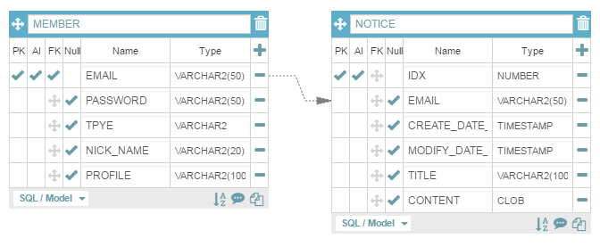

# Summary

Personal project using Spring Boot

# Build

* **VM options**

    > -Xbootclasspath/p:./alpn-boot-8.1.11.v20170118.jar

# Back-End

* Spring Boot 1.5.3.RELEASE
* Spring Security 4.2.2.RELEASE
* Data-JPA 1.5.3.RELEASE ( Hibernate 5.0.12.Final )

## Servlet Container

* Undertow 1.4.11.Final

# Front-End

* Freemarker 1.5.2.RELEASE
* Angular 1.6.4.RELEASE
* Bootstrap 4.0.0-alpha.6

## Plugin

* Summernote 0.8.2

# Database

* H2 1.4.193
* Redis 2.8.19

## ERD

##### Coming soon !!!

* ~~spring security~~
* ~~http2.0/ssl~~
* ~~send initialized password to this email~~
* add comment of notice